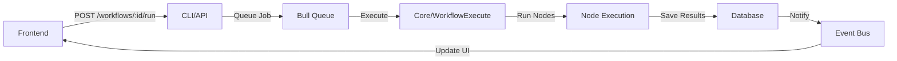

## Project Overview

n8n is a workflow automation platform built with TypeScript, using a **monorepo structure** managed by pnpm workspaces. The platform consists of:

- **Node.js backend** with Express and TypeORM
- **Vue 3 frontend** with Vite and Pinia
- **Extensible node-based workflow engine**
- **Multiple specialized packages** for different concerns

## Monorepo Structure

n8n uses **pnpm workspaces** with **Turbo** for build orchestration. This enables:

- Isolated package development with shared dependencies
- Automatic file-linking between interdependent modules
- Parallel builds with smart caching
- Independent versioning and testing

### Workspace Configuration

The monorepo is defined in `pnpm-workspace.yaml`:

```yaml
packages:
  - packages/*
  - packages/@n8n/*
  - packages/frontend/**
  - packages/extensions/**
  - packages/testing/**
```

### Build Orchestration

Turbo (`turbo.json`) orchestrates builds with dependency awareness:

```json
{
  "tasks": {
    "build": {
      "dependsOn": ["^build"],
      "outputs": ["dist/**"]
    },
    "typecheck": {
      "dependsOn": ["^typecheck", "^build"]
    },
    "test": {
      "dependsOn": ["^build", "build"]
    }
  }
}
```

The `^` prefix means "run this task on all dependencies first."

## Package Structure

The monorepo is organized into logical packages with clear responsibilities:

### Core Packages

<CodeGroup>

```typescript packages/workflow
// Core workflow interfaces and types
// Shared between frontend and backend
export interface IWorkflowBase {
  id?: string;
  name: string;
  active: boolean;
  nodes: INode[];
  connections: IConnections;
}
```

```typescript packages/core
// Workflow execution engine
// Handles active webhooks and workflow runs
export class WorkflowExecute {
  async run(workflow: Workflow): Promise<IExecutionResponse> {
    // Execution logic
  }
}
```

```typescript packages/cli
// Express server, REST API, CLI commands
// Entry point for backend operations
export class Server extends AbstractServer {
  async start(): Promise<void> {
    // Start HTTP server and API
  }
}
```

</CodeGroup>

### Frontend Packages

<CodeGroup>

```typescript packages/frontend/editor-ui
// Vue 3 frontend application
// Main workflow editor interface
import { createApp } from 'vue';
import { createPinia } from 'pinia';

const app = createApp(App);
app.use(createPinia());
```

```typescript packages/@n8n/design-system
// Vue component library
// Reusable UI components with design tokens
export { N8nButton, N8nInput, N8nModal };
```

```typescript packages/@n8n/i18n
// Internationalization
// UI text translations
export const messages = {
  en: { /* English translations */ },
  de: { /* German translations */ },
};
```

</CodeGroup>

### Integration Packages

<CodeGroup>

```typescript packages/nodes-base
// Built-in nodes for integrations
// 300+ nodes for different services
export class HttpRequest implements INodeType {
  description: INodeTypeDescription = {
    displayName: 'HTTP Request',
    name: 'httpRequest',
    // ...
  };
}
```

```typescript packages/@n8n/nodes-langchain
// AI/LangChain nodes
// Specialized nodes for AI workflows
export class OpenAiChat implements INodeType {
  // OpenAI integration
}
```

</CodeGroup>

### Shared Packages

| Package | Purpose | Used By |
|---------|---------|--------|
| `@n8n/api-types` | TypeScript interfaces for API | Frontend & Backend |
| `@n8n/config` | Centralized configuration | All packages |
| `@n8n/di` | Dependency injection container | Backend services |
| `@n8n/utils` | Shared utilities | All packages |

### Development Packages

| Package | Purpose |
|---------|--------|
| `@n8n/node-cli` | CLI to create new n8n nodes |
| `packages/testing/playwright` | E2E tests with Playwright |
| `packages/testing/containers` | Testcontainers for local testing |
| `packages/testing/janitor` | Test architecture enforcement |

## Directory Structure

```
n8n/
├── packages/
│   ├── @n8n/
│   │   ├── api-types/          # Shared TypeScript interfaces
│   │   ├── config/             # Configuration management
│   │   ├── di/                 # Dependency injection
│   │   ├── design-system/      # Vue components
│   │   ├── i18n/               # Translations
│   │   ├── nodes-langchain/    # AI nodes
│   │   └── ...
│   ├── cli/                     # Express server & API
│   │   ├── src/
│   │   │   ├── controllers/    # REST API controllers
│   │   │   ├── services/       # Business logic
│   │   │   ├── repositories/   # Database access
│   │   │   └── modules/        # Feature modules
│   │   └── bin/n8n             # CLI entry point
│   ├── core/                    # Workflow execution
│   ├── frontend/
│   │   ├── editor-ui/          # Vue workflow editor
│   │   └── @n8n/
│   │       ├── design-system/
│   │       ├── stores/         # Pinia stores
│   │       └── composables/    # Vue composables
│   ├── nodes-base/              # Built-in nodes
│   ├── workflow/                # Workflow types
│   └── testing/
│       ├── playwright/         # E2E tests
│       └── containers/         # Test infrastructure
├── docker/
│   └── images/                  # Dockerfiles
├── pnpm-workspace.yaml          # Workspace config
├── turbo.json                   # Build orchestration
└── package.json                 # Root scripts
```

## Technology Stack

### Backend

- **Runtime:** Node.js 24+
- **Framework:** Express
- **Language:** TypeScript
- **ORM:** TypeORM
- **Databases:** SQLite, PostgreSQL, MySQL
- **Queue:** Bull (Redis-based)
- **Testing:** Jest (unit), Supertest (integration)

### Frontend

- **Framework:** Vue 3
- **Build Tool:** Vite
- **State Management:** Pinia
- **Router:** Vue Router
- **UI Library:** Element Plus + Custom Design System
- **Component Development:** Storybook
- **Testing:** Vitest (unit), Playwright (E2E)

### Code Quality

- **Formatting:** Biome
- **Linting:** ESLint
- **Type Checking:** TypeScript
- **Git Hooks:** Lefthook

## Architectural Patterns

### 1. Dependency Injection

n8n uses `@n8n/di` for IoC (Inversion of Control):

```typescript
import { Service } from '@n8n/di';

@Service()
export class WorkflowService {
  constructor(
    private workflowRepository: WorkflowRepository,
    private executionService: ExecutionService,
  ) {}
}
```

### 2. Controller-Service-Repository

Backend follows MVC-like pattern:

```typescript
// Controller: Handle HTTP requests
@RestController('/workflows')
export class WorkflowsController {
  constructor(private workflowService: WorkflowService) {}

  @Get('/:id')
  async getWorkflow(@Param('id') id: string) {
    return await this.workflowService.findById(id);
  }
}

// Service: Business logic
@Service()
export class WorkflowService {
  constructor(private workflowRepository: WorkflowRepository) {}

  async findById(id: string) {
    return await this.workflowRepository.findById(id);
  }
}

// Repository: Database access
@Service()
export class WorkflowRepository {
  async findById(id: string) {
    return await this.em.findOne(WorkflowEntity, id);
  }
}
```

### 3. Event-Driven Architecture

Internal event bus enables decoupled communication:

```typescript
import { EventService } from '@n8n/event-service';

@Service()
export class WorkflowService {
  constructor(private eventService: EventService) {}

  async activateWorkflow(workflowId: string) {
    // Activate logic...
    await this.eventService.emit('workflow.activated', { workflowId });
  }
}

// Somewhere else
eventService.on('workflow.activated', async ({ workflowId }) => {
  // Handle activation
});
```

### 4. Context-Based Execution

Workflows execute in different contexts based on node types:

```typescript
interface IExecuteContext {
  getNodeParameter(name: string): unknown;
  getInputData(): INodeExecutionData[];
  helpers: IExecuteHelpers;
}

class HttpRequest implements INodeType {
  async execute(this: IExecuteContext) {
    const url = this.getNodeParameter('url') as string;
    const data = this.getInputData();
    // Execute HTTP request
  }
}
```

### 5. Frontend State Management

Pinia stores manage application state:

```typescript
import { defineStore } from 'pinia';

export const useWorkflowsStore = defineStore('workflows', () => {
  const workflows = ref<IWorkflowDb[]>([]);

  async function fetchWorkflows() {
    workflows.value = await api.getWorkflows();
  }

  return { workflows, fetchWorkflows };
});
```

### 6. Design System

Centralized components ensure consistency:

```typescript
// @n8n/design-system
export const N8nButton = defineComponent({
  props: {
    type: { type: String, default: 'primary' },
    size: { type: String, default: 'medium' },
  },
  // Component logic
});

// Used in editor-ui
import { N8nButton } from '@n8n/design-system';
```

## Data Flow

### Workflow Execution Flow



### Node Communication

Nodes communicate through connections:

```typescript
interface IConnections {
  [nodeName: string]: {
    [outputType: string]: Array<
      Array<{
        node: string;
        type: string;
        index: number;
      }>
    >;
  };
}

// Example
const connections: IConnections = {
  'HTTP Request': {
    main: [[
      { node: 'Set', type: 'main', index: 0 },
    ]],
  },
};
```

### Workflow Traversal

Use graph traversal utilities from `n8n-workflow`:

```typescript
import {
  getParentNodes,
  getChildNodes,
  mapConnectionsByDestination,
} from 'n8n-workflow';

// workflow.connections is indexed by source node
// To find parent nodes, invert it first:
const connectionsByDestination = mapConnectionsByDestination(workflow.connections);
const parents = getParentNodes(connectionsByDestination, 'NodeName', 'main', 1);

// To find child nodes, use connections directly:
const children = getChildNodes(workflow.connections, 'NodeName', 'main', 1);
```

## Module Organization

### Backend Modules

Features are organized into modules with clear boundaries:

```
packages/cli/src/modules/
├── workflows/
│   ├── workflows.controller.ts
│   ├── workflows.service.ts
│   └── workflows.repository.ts
├── executions/
├── credentials/
├── users/
└── projects/
```

### Frontend Modules

Vue components follow feature-based organization:

```
packages/frontend/editor-ui/src/
├── components/
│   ├── WorkflowCanvas/
│   ├── NodeSettings/
│   └── ExecutionView/
├── stores/
│   ├── workflows.store.ts
│   ├── ui.store.ts
│   └── settings.store.ts
├── views/
│   ├── WorkflowEditor.vue
│   └── ExecutionsList.vue
└── composables/
```

## Development Workflows

Each package can be developed independently:

```bash
# Develop a specific package
cd packages/cli
pnpm dev

# Build a specific package
cd packages/workflow
pnpm build

# Test a specific package
cd packages/core
pnpm test
```

## Key Conventions

<Note>
**TypeScript Best Practices:**
- Never use `any` type - use proper types or `unknown`
- Avoid type casting with `as` - use type guards instead
- Define shared interfaces in `@n8n/api-types` for FE/BE communication
</Note>

<Note>
**Error Handling:**
- Use `UnexpectedError`, `OperationalError`, or `UserError`
- Deprecated: `ApplicationError` class
</Note>

<Note>
**Frontend Development:**
- All UI text must use i18n - add translations to `@n8n/i18n`
- Use CSS variables - never hardcode spacing as px values
- `data-testid` must be a single value (no spaces)
</Note>

## Next Steps

- Learn about [testing practices](/contributing/testing)
- Review [contribution guidelines](/contributing/guidelines)
- Explore the [development setup guide](/contributing/setup)
