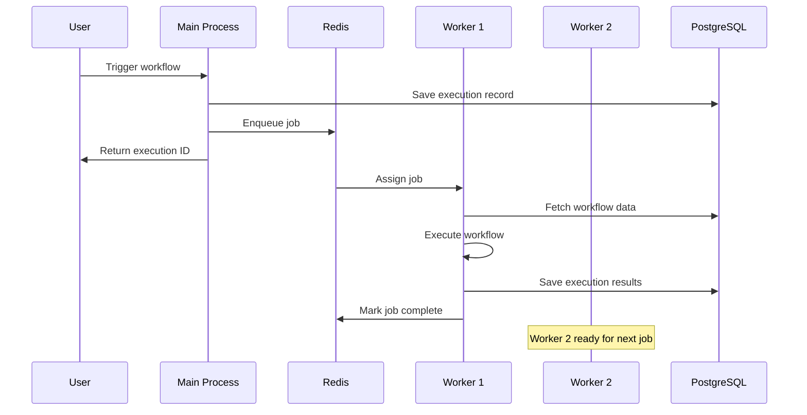

As your automation needs grow, n8n can scale horizontally to handle thousands of concurrent workflow executions. This guide covers queue mode architecture, worker configuration, and scaling strategies.

## Understanding Queue Mode

Queue mode transforms n8n from a single-process application into a distributed system where workflow executions are processed by dedicated worker processes.

### Architecture Components

<CardGroup cols={2}>
  <Card title="Main Process" icon="server">
    - Serves web UI and API
    - Manages workflow definitions
    - Handles user authentication
    - Enqueues executions to Redis
    - Does NOT execute workflows
  </Card>
  
  <Card title="Worker Processes" icon="gears">
    - Pull execution jobs from Redis queue
    - Execute workflow nodes
    - Save results to database
    - Can be scaled independently
    - Run on separate servers/containers
  </Card>
  
  <Card title="Redis (Message Broker)" icon="database">
    - Manages job queue (Bull)
    - Coordinates between main and workers
    - Handles job priorities and retries
    - Stores temporary execution state
  </Card>
  
  <Card title="PostgreSQL (Database)" icon="table">
    - Stores workflow definitions
    - Stores execution results
    - Manages credentials (encrypted)
    - Shared by all components
    - **Required** for queue mode
  </Card>
</CardGroup>

### Execution Flow



## Prerequisites

<Steps>
  <Step title="PostgreSQL Database">
    Queue mode **requires** PostgreSQL. SQLite is not supported.
    
    ```bash
    DB_TYPE=postgresdb
    DB_POSTGRESDB_HOST=postgres.example.com
    DB_POSTGRESDB_DATABASE=n8n
    DB_POSTGRESDB_USER=n8n_user
    DB_POSTGRESDB_PASSWORD=secure-password
    ```
  </Step>
  
  <Step title="Redis Server">
    Redis 6.0 or higher recommended.
    
    ```bash
    QUEUE_BULL_REDIS_HOST=redis.example.com
    QUEUE_BULL_REDIS_PORT=6379
    QUEUE_BULL_REDIS_PASSWORD=redis-password  # if using auth
    ```
  </Step>
  
  <Step title="Shared Encryption Key">
    **Critical**: All processes must use the same encryption key.
    
    ```bash
    N8N_ENCRYPTION_KEY=same-key-for-all-processes
    ```
  </Step>
</Steps>

<Warning>
  **Common Mistakes:**
  - Using different encryption keys across processes
  - Not persisting `/home/node/.n8n` on main process
  - Running workers without database access
  - Forgetting to configure Redis authentication
</Warning>

## Basic Queue Mode Setup

### Docker Compose Configuration

<CodeGroup>
```yaml docker-compose.yml
version: '3.8'

volumes:
  n8n_data:
  postgres_data:
  redis_data:

services:
  postgres:
    image: postgres:16-alpine
    restart: unless-stopped
    environment:
      POSTGRES_DB: n8n
      POSTGRES_USER: n8n
      POSTGRES_PASSWORD: ${DB_PASSWORD}
    volumes:
      - postgres_data:/var/lib/postgresql/data
    healthcheck:
      test: ['CMD-SHELL', 'pg_isready -U n8n']
      interval: 5s
      timeout: 5s
      retries: 10

  redis:
    image: redis:6.2.14-alpine
    restart: unless-stopped
    command: redis-server --appendonly yes --requirepass ${REDIS_PASSWORD}
    volumes:
      - redis_data:/data
    healthcheck:
      test: ['CMD', 'redis-cli', '--raw', 'incr', 'ping']
      interval: 5s
      timeout: 3s
      retries: 5

  n8n:
    image: ghcr.io/n8n-io/n8n:latest
    restart: unless-stopped
    ports:
      - "5678:5678"
    environment:
      # Database
      - DB_TYPE=postgresdb
      - DB_POSTGRESDB_HOST=postgres
      - DB_POSTGRESDB_DATABASE=n8n
      - DB_POSTGRESDB_USER=n8n
      - DB_POSTGRESDB_PASSWORD=${DB_PASSWORD}
      # Redis Queue
      - EXECUTIONS_MODE=queue
      - QUEUE_BULL_REDIS_HOST=redis
      - QUEUE_BULL_REDIS_PASSWORD=${REDIS_PASSWORD}
      # n8n Config
      - N8N_ENCRYPTION_KEY=${N8N_ENCRYPTION_KEY}
      - N8N_HOST=${N8N_HOST}
      - N8N_PROTOCOL=https
      - WEBHOOK_URL=https://${N8N_HOST}/
      # Monitoring
      - N8N_METRICS=true
    volumes:
      - n8n_data:/home/node/.n8n
    depends_on:
      postgres:
        condition: service_healthy
      redis:
        condition: service_healthy

  n8n-worker:
    image: ghcr.io/n8n-io/n8n:latest
    restart: unless-stopped
    command: worker
    environment:
      # Database
      - DB_TYPE=postgresdb
      - DB_POSTGRESDB_HOST=postgres
      - DB_POSTGRESDB_DATABASE=n8n
      - DB_POSTGRESDB_USER=n8n
      - DB_POSTGRESDB_PASSWORD=${DB_PASSWORD}
      # Redis Queue
      - EXECUTIONS_MODE=queue
      - QUEUE_BULL_REDIS_HOST=redis
      - QUEUE_BULL_REDIS_PASSWORD=${REDIS_PASSWORD}
      # Worker Config
      - QUEUE_HEALTH_CHECK_ACTIVE=true
      - N8N_CONCURRENCY_PRODUCTION_LIMIT=10
      # n8n Config
      - N8N_ENCRYPTION_KEY=${N8N_ENCRYPTION_KEY}
    depends_on:
      postgres:
        condition: service_healthy
      redis:
        condition: service_healthy
    deploy:
      replicas: 3  # Start with 3 workers
```

```bash .env
DB_PASSWORD=secure-database-password
REDIS_PASSWORD=secure-redis-password
N8N_ENCRYPTION_KEY=your-secure-encryption-key-32-chars
N8N_HOST=workflows.example.com
```
</CodeGroup>

### Starting in Queue Mode

```bash
# Start all services
docker compose up -d

# Scale workers dynamically
docker compose up -d --scale n8n-worker=5

# View logs
docker compose logs -f n8n-worker
```

## Worker Configuration

### Concurrency Settings

<ParamField path="N8N_CONCURRENCY_PRODUCTION_LIMIT" type="number" default="-1">
  Maximum concurrent executions per worker. `-1` means unlimited.
  
  ```bash
  N8N_CONCURRENCY_PRODUCTION_LIMIT=10
  ```
  
  <Note>
    **Recommendation**: Start with 5-10 per worker, adjust based on:
    - Available CPU cores (1-2 executions per core)
    - Memory per worker (500MB-1GB per execution)
    - Execution complexity and duration
  </Note>
</ParamField>

### Worker Resources

<Tabs>
  <Tab title="Light Workloads">
    Simple workflows with minimal data processing.
    
    ```yaml
    deploy:
      resources:
        limits:
          cpus: '1.0'
          memory: 1G
        reservations:
          cpus: '0.5'
          memory: 512M
    environment:
      - N8N_CONCURRENCY_PRODUCTION_LIMIT=5
    ```
  </Tab>
  
  <Tab title="Medium Workloads">
    Standard workflows with API calls and data transformations.
    
    ```yaml
    deploy:
      resources:
        limits:
          cpus: '2.0'
          memory: 2G
        reservations:
          cpus: '1.0'
          memory: 1G
    environment:
      - N8N_CONCURRENCY_PRODUCTION_LIMIT=10
    ```
  </Tab>
  
  <Tab title="Heavy Workloads">
    Complex workflows with large data processing.
    
    ```yaml
    deploy:
      resources:
        limits:
          cpus: '4.0'
          memory: 4G
        reservations:
          cpus: '2.0'
          memory: 2G
    environment:
      - N8N_CONCURRENCY_PRODUCTION_LIMIT=15
    ```
  </Tab>
</Tabs>

### Worker Lock Settings

<ParamField path="QUEUE_WORKER_LOCK_DURATION" type="number" default="60000">
  How long (ms) a worker holds a job lease.
  
  ```bash
  QUEUE_WORKER_LOCK_DURATION=120000  # 2 minutes
  ```
</ParamField>

<ParamField path="QUEUE_WORKER_LOCK_RENEW_TIME" type="number" default="10000">
  How often (ms) to renew the job lease.
  
  ```bash
  QUEUE_WORKER_LOCK_RENEW_TIME=15000  # 15 seconds
  ```
</ParamField>

<ParamField path="QUEUE_WORKER_STALLED_INTERVAL" type="number" default="30000">
  How often (ms) to check for stalled jobs.
  
  ```bash
  QUEUE_WORKER_STALLED_INTERVAL=60000  # 1 minute
  ```
</ParamField>

## Advanced Scaling

### Queue Mode with Task Runners

Combine queue mode with external task runners for maximum isolation:

```yaml
services:
  n8n-worker:
    image: ghcr.io/n8n-io/n8n:latest
    command: worker
    environment:
      # ... database and queue config ...
      # Task Runner Config
      - N8N_RUNNERS_MODE=external
      - N8N_RUNNERS_BROKER_LISTEN_ADDRESS=0.0.0.0
      - N8N_RUNNERS_AUTH_TOKEN=${RUNNER_TOKEN}
      - N8N_RUNNERS_MAX_CONCURRENCY=20
    deploy:
      replicas: 3

  # One or more runners per worker
  n8n-worker-runners:
    image: ghcr.io/n8n-io/runners:latest
    environment:
      - N8N_RUNNERS_TASK_BROKER_URI=http://n8n-worker:5679
      - N8N_RUNNERS_AUTH_TOKEN=${RUNNER_TOKEN}
    depends_on:
      - n8n-worker
    deploy:
      replicas: 6  # 2 runners per worker
```

### Multi-Main Setup (Enterprise)

Run multiple main processes for high availability:

```yaml
services:
  nginx:
    image: nginx:latest
    ports:
      - "5678:80"
    volumes:
      - ./nginx.conf:/etc/nginx/nginx.conf:ro
    depends_on:
      - n8n-main-1
      - n8n-main-2

  n8n-main-1:
    image: ghcr.io/n8n-io/n8n:latest
    environment:
      - EXECUTIONS_MODE=queue
      - N8N_MULTI_MAIN_SETUP_ENABLED=true
      - N8N_MULTI_MAIN_SETUP_KEY_TTL=10
      # ... other config ...
    volumes:
      - n8n_data_1:/home/node/.n8n

  n8n-main-2:
    image: ghcr.io/n8n-io/n8n:latest
    environment:
      - EXECUTIONS_MODE=queue
      - N8N_MULTI_MAIN_SETUP_ENABLED=true
      - N8N_MULTI_MAIN_SETUP_KEY_TTL=10
      # ... other config ...
    volumes:
      - n8n_data_2:/home/node/.n8n

  n8n-worker:
    # ... workers config ...
    deploy:
      replicas: 5
```

<CodeGroup>
```nginx nginx.conf
upstream n8n_backend {
    least_conn;
    server n8n-main-1:5678;
    server n8n-main-2:5678;
}

server {
    listen 80;
    
    location / {
        proxy_pass http://n8n_backend;
        proxy_set_header Host $host;
        proxy_set_header X-Real-IP $remote_addr;
        proxy_set_header X-Forwarded-For $proxy_add_x_forwarded_for;
        proxy_set_header X-Forwarded-Proto $scheme;
        
        # WebSocket support
        proxy_http_version 1.1;
        proxy_set_header Upgrade $http_upgrade;
        proxy_set_header Connection "upgrade";
    }
}
```
</CodeGroup>

## Redis Configuration

### Redis Cluster

For high availability Redis:

```bash
QUEUE_BULL_REDIS_CLUSTER_NODES=redis-1:6379,redis-2:6379,redis-3:6379
QUEUE_BULL_REDIS_PASSWORD=cluster-password
```

### Redis with TLS

```bash
QUEUE_BULL_REDIS_TLS=true
QUEUE_BULL_REDIS_HOST=redis.secure.internal

# For AWS ElastiCache
QUEUE_BULL_REDIS_DNS_LOOKUP_STRATEGY=NONE
```

### Redis Performance Tuning

<Accordion title="Connection Settings">
  ```bash
  # Keep-alive for stable connections
  QUEUE_BULL_REDIS_KEEP_ALIVE=true
  QUEUE_BULL_REDIS_KEEP_ALIVE_DELAY=5000
  QUEUE_BULL_REDIS_KEEP_ALIVE_INTERVAL=5000
  
  # Timeout thresholds
  QUEUE_BULL_REDIS_TIMEOUT_THRESHOLD=30000
  
  # Reconnect on failover
  QUEUE_BULL_REDIS_RECONNECT_ON_FAILOVER=true
  ```
</Accordion>

<Accordion title="Memory Management">
  ```redis
  # redis.conf settings
  maxmemory 2gb
  maxmemory-policy allkeys-lru
  
  # Persistence
  appendonly yes
  appendfsync everysec
  ```
</Accordion>

## Monitoring and Observability

### Prometheus Metrics

Enable metrics on all processes:

```bash
N8N_METRICS=true
N8N_METRICS_INCLUDE_DEFAULT_METRICS=true
N8N_METRICS_INCLUDE_QUEUE_METRICS=true
N8N_METRICS_QUEUE_METRICS_INTERVAL=20
```

<Note>
  Queue metrics are not supported in multi-main setup.
</Note>

### Key Metrics to Monitor

<AccordionGroup>
  <Accordion title="Queue Metrics">
    - `n8n_queue_jobs_waiting` - Jobs waiting to be processed
    - `n8n_queue_jobs_active` - Currently executing jobs
    - `n8n_queue_jobs_completed` - Successfully completed jobs
    - `n8n_queue_jobs_failed` - Failed jobs
    - `n8n_queue_jobs_delayed` - Scheduled for future execution
  </Accordion>
  
  <Accordion title="Worker Metrics">
    - `process_cpu_user_seconds_total` - CPU usage
    - `process_resident_memory_bytes` - Memory usage
    - `n8n_workflow_executions_total` - Execution count
    - `n8n_workflow_execution_duration_seconds` - Execution duration
  </Accordion>
  
  <Accordion title="Database Metrics">
    - Connection pool utilization
    - Query execution time
    - Active connections
  </Accordion>
</AccordionGroup>

### Health Checks

Enable worker health endpoints:

```yaml
services:
  n8n-worker:
    environment:
      - QUEUE_HEALTH_CHECK_ACTIVE=true
      - QUEUE_HEALTH_CHECK_PORT=5678
    healthcheck:
      test: ['CMD-SHELL', 'wget --spider -q http://localhost:5678/healthz || exit 1']
      interval: 30s
      timeout: 10s
      retries: 3
      start_period: 60s
```

## Scaling Strategies

### When to Scale

<Steps>
  <Step title="Monitor Queue Depth">
    ```bash
    # Check waiting jobs in Redis
    redis-cli LLEN bull:n8n:jobs:waiting
    ```
    
    **Action**: If consistently > 100, add workers.
  </Step>
  
  <Step title="Check Worker CPU">
    ```bash
    # Monitor worker resource usage
    docker stats n8n-worker
    ```
    
    **Action**: If CPU > 80%, add more workers or reduce concurrency.
  </Step>
  
  <Step title="Measure Execution Latency">
    Track time from trigger to execution start.
    
    **Action**: If latency > 5 seconds, scale workers.
  </Step>
  
  <Step title="Review Failed Jobs">
    ```bash
    # Check failed job count
    redis-cli LLEN bull:n8n:jobs:failed
    ```
    
    **Action**: Investigate failures, may indicate resource constraints.
  </Step>
</Steps>

### Horizontal Scaling Formula

```
Workers Needed = (Peak Executions per Minute) / (Worker Concurrency × 60)

Example:
- Peak: 300 executions/minute
- Worker concurrency: 10
- Workers: 300 / (10 × 60) = 0.5 workers minimum

Add 50% buffer: 1 worker minimum, scale to 2-3 for resilience
```

### Vertical vs Horizontal Scaling

<Tabs>
  <Tab title="Horizontal Scaling (Recommended)">
    **Add more workers**
    
    ✅ Pros:
    - Better fault tolerance
    - Easier to scale incrementally
    - Can distribute across servers
    - No single point of failure
    
    ❌ Cons:
    - More complex infrastructure
    - Requires load balancing (multi-main)
    - Higher operational overhead
  </Tab>
  
  <Tab title="Vertical Scaling">
    **Increase worker resources**
    
    ✅ Pros:
    - Simpler configuration
    - Less coordination needed
    - Lower network overhead
    
    ❌ Cons:
    - Limited by hardware
    - Single point of failure
    - More expensive at scale
    - Harder to utilize efficiently
  </Tab>
</Tabs>

## Performance Optimization

### Database Optimization

<Accordion title="Connection Pooling">
  ```bash
  # Match pool size to expected concurrent queries
  DB_POSTGRESDB_POOL_SIZE=20
  
  # Adjust timeouts
  DB_POSTGRESDB_CONNECTION_TIMEOUT=30000
  DB_POSTGRESDB_STATEMENT_TIMEOUT=60000
  ```
</Accordion>

<Accordion title="Execution Data Pruning">
  ```bash
  # Enable automatic cleanup
  EXECUTIONS_DATA_PRUNE=true
  
  # Keep last 7 days
  EXECUTIONS_DATA_MAX_AGE=168
  
  # Or limit by count
  EXECUTIONS_DATA_PRUNE_MAX_COUNT=50000
  
  # Hard delete after 24 hours
  EXECUTIONS_DATA_HARD_DELETE_BUFFER=24
  ```
</Accordion>

<Accordion title="PostgreSQL Settings">
  ```sql
  -- postgresql.conf
  max_connections = 100
  shared_buffers = 2GB
  effective_cache_size = 6GB
  maintenance_work_mem = 512MB
  checkpoint_completion_target = 0.9
  wal_buffers = 16MB
  default_statistics_target = 100
  random_page_cost = 1.1
  effective_io_concurrency = 200
  work_mem = 10MB
  ```
</Accordion>

### Execution Optimization

<Accordion title="Timeout Configuration">
  ```bash
  # Global execution timeout
  EXECUTIONS_TIMEOUT=300  # 5 minutes
  
  # Maximum allowed timeout
  EXECUTIONS_TIMEOUT_MAX=3600  # 1 hour
  
  # Task runner timeout
  N8N_RUNNERS_TASK_TIMEOUT=600  # 10 minutes
  ```
</Accordion>

<Accordion title="Memory Limits">
  ```bash
  # Task runner max memory
  N8N_RUNNERS_MAX_OLD_SPACE_SIZE=2048  # 2GB
  
  # Node.js memory (for workers)
  NODE_OPTIONS=--max-old-space-size=2048
  ```
</Accordion>

## Troubleshooting

<AccordionGroup>
  <Accordion title="Jobs stuck in queue">
    **Symptoms**: Jobs waiting but workers idle
    
    **Causes**:
    1. Workers can't connect to Redis
    2. Different encryption keys
    3. Workers crashed
    
    **Solutions**:
    ```bash
    # Check worker logs
    docker compose logs -f n8n-worker
    
    # Verify Redis connection
    docker compose exec n8n-worker nc -zv redis 6379
    
    # Check encryption key
    docker compose exec n8n env | grep ENCRYPTION_KEY
    docker compose exec n8n-worker env | grep ENCRYPTION_KEY
    
    # Restart workers
    docker compose restart n8n-worker
    ```
  </Accordion>
  
  <Accordion title="High Redis memory usage">
    **Symptoms**: Redis running out of memory
    
    **Causes**:
    - Too many failed jobs accumulating
    - Large payloads in jobs
    - No eviction policy
    
    **Solutions**:
    ```bash
    # Clear failed jobs (careful!)
    redis-cli DEL bull:n8n:jobs:failed
    
    # Set Redis eviction policy
    redis-cli CONFIG SET maxmemory-policy allkeys-lru
    redis-cli CONFIG SET maxmemory 2gb
    
    # Enable AOF persistence
    redis-cli CONFIG SET appendonly yes
    ```
  </Accordion>
  
  <Accordion title="Workers not scaling">
    **Symptoms**: Adding workers doesn't increase throughput
    
    **Causes**:
    1. Database bottleneck
    2. Redis bottleneck
    3. Network limitations
    4. CPU constraints
    
    **Solutions**:
    - Monitor database query times
    - Check Redis CPU usage
    - Profile slow workflows
    - Increase database connections
    - Consider database read replicas
  </Accordion>
</AccordionGroup>

## Best Practices

<CardGroup cols={2}>
  <Card title="Start Small" icon="seedling">
    Begin with 2-3 workers and scale based on metrics, not guesses.
  </Card>
  
  <Card title="Monitor Everything" icon="chart-line">
    Track queue depth, worker CPU/memory, database performance, and execution latency.
  </Card>
  
  <Card title="Use Health Checks" icon="heart-pulse">
    Enable health checks on all components for automatic recovery.
  </Card>
  
  <Card title="Plan for Failures" icon="shield">
    Design workflows to be idempotent and handle retries gracefully.
  </Card>
  
  <Card title="Prune Execution Data" icon="broom">
    Regularly clean old execution data to maintain database performance.
  </Card>
  
  <Card title="Secure Redis" icon="lock">
    Always use authentication and TLS for Redis in production.
  </Card>
</CardGroup>

## Next Steps

<CardGroup cols={3}>
  <Card title="Configuration Reference" icon="gear" href="/hosting/configuration">
    Complete list of environment variables
  </Card>
  <Card title="Docker Deployment" icon="docker" href="/hosting/docker">
    Docker Compose examples
  </Card>
  <Card title="Self-Hosting Overview" icon="server" href="/hosting/overview">
    Understanding deployment options
  </Card>
</CardGroup>