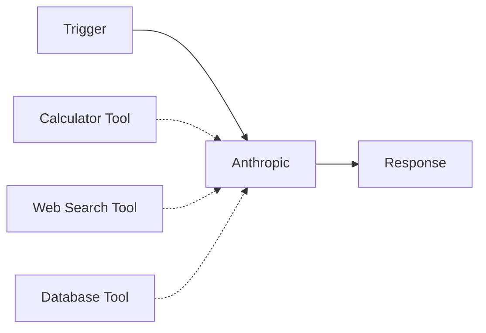
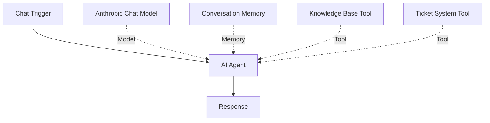
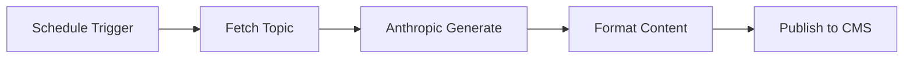
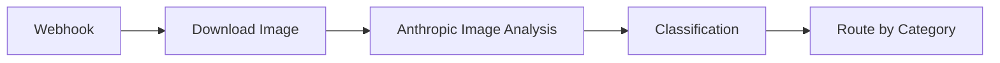
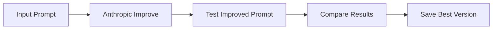

# Anthropic Integration

The Anthropic integration brings Claude, one of the most capable AI assistants, to your n8n workflows. Claude excels at complex reasoning, document analysis, coding tasks, and maintaining context over long conversations.

## Available Nodes

<CardGroup cols={2}>
  <Card title="Anthropic Node" icon="robot" href="#anthropic-node">
    Direct access to Claude for text, image, document analysis, and prompt engineering
  </Card>
  <Card title="Anthropic Chat Model" icon="comments" href="#anthropic-chat-model">
    Use Claude with AI Agent for advanced workflows with tools and memory
  </Card>
</CardGroup>

## Prerequisites

Before you begin, you'll need:

- An Anthropic account
- An Anthropic API key (get one from [Anthropic Console](https://console.anthropic.com/))
- API credits in your Anthropic account

## Setup

<Steps>
  <Step title="Get Your API Key">
    1. Go to [Anthropic Console](https://console.anthropic.com/)
    2. Navigate to **API Keys** section
    3. Click **Create Key**
    4. Copy the API key immediately (it won't be shown again)
    5. Store it securely
  </Step>
  
  <Step title="Configure in n8n">
    1. Add an Anthropic node to your workflow
    2. Click **Credential to connect with**
    3. Select **Create New Credential**
    4. Paste your API key in the **API Key** field
    5. (Optional) Configure custom base URL if needed
    6. (Optional) Add custom headers for advanced use cases
    7. Click **Save**
  </Step>
  
  <Step title="Verify Connection">
    Test your setup by sending a simple message to verify the credentials work correctly.
  </Step>
</Steps>

## Anthropic Node

The Anthropic node provides comprehensive access to Claude's capabilities across multiple resources.

### Available Resources

<Tabs>
  <Tab title="Text">
    Send messages to Claude and receive intelligent responses.
    
    **Operations:**
    - **Message**: Send prompts and get responses from Claude
    
    **Features:**
    - Multi-turn conversations with system prompts
    - Tool/function calling support
    - Streaming responses
    - Temperature and token control
    
    **Example Configuration:**
    ```json
    {
      "resource": "text",
      "operation": "message",
      "modelId": "claude-3-5-sonnet-20241022",
      "messages": [
        {
          "content": "Explain quantum computing in simple terms",
          "role": "user"
        }
      ]
    }
    ```
    
    **Available Roles:**
    - **User**: Send messages as the user
    - **Assistant**: Set Claude's tone and personality
  </Tab>
  
  <Tab title="Document">
    Analyze documents including PDFs, text files, and more.
    
    **Operations:**
    - **Analyze**: Extract information and insights from documents
    
    **Supported Formats:**
    - PDF documents
    - Text files
    - Markdown files
    - Other text-based formats
    
    **Use Cases:**
    - Document summarization
    - Information extraction
    - Contract analysis
    - Research paper review
    - Report generation
    
    **Example:**
    ```json
    {
      "resource": "document",
      "operation": "analyze",
      "modelId": "claude-3-5-sonnet-20241022",
      "prompt": "Summarize the key points from this contract",
      "binaryPropertyName": "data"
    }
    ```
  </Tab>
  
  <Tab title="Image">
    Analyze images and extract information using Claude's vision capabilities.
    
    **Operations:**
    - **Analyze**: Understand and describe images
    
    **Capabilities:**
    - Image description
    - Object detection
    - Text extraction (OCR)
    - Scene understanding
    - Visual question answering
    
    **Supported Formats:**
    - JPEG, PNG, GIF, WebP
    - Base64 encoded images
    - Image URLs
    - Binary image data
    
    **Example:**
    ```json
    {
      "resource": "image",
      "operation": "analyze",
      "modelId": "claude-3-5-sonnet-20241022",
      "prompt": "What is shown in this image? List all objects you can see.",
      "binaryPropertyName": "data"
    }
    ```
    
    <Note>
      Image analysis is available in Claude 3 Opus, Sonnet, and Haiku models.
    </Note>
  </Tab>
  
  <Tab title="Prompt">
    Leverage Anthropic's prompt engineering tools to improve your prompts.
    
    **Operations:**
    - **Generate**: Create prompts for specific tasks
    - **Improve**: Enhance existing prompts
    - **Templatize**: Convert prompts into reusable templates
    
    **Generate Prompt:**
    Automatically generate optimized prompts based on your task description.
    
    ```json
    {
      "resource": "prompt",
      "operation": "generate",
      "taskDescription": "Extract product information from customer reviews"
    }
    ```
    
    **Improve Prompt:**
    Get suggestions to enhance your existing prompts for better results.
    
    ```json
    {
      "resource": "prompt",
      "operation": "improve",
      "prompt": "Summarize this article"
    }
    ```
    
    **Templatize Prompt:**
    Convert a working prompt into a template with variables.
    
    ```json
    {
      "resource": "prompt",
      "operation": "templatize",
      "prompt": "Write a blog post about cats that is 500 words long"
    }
    ```
    
    <Note>
      Prompt engineering features help you get the most out of Claude by optimizing your prompts.
    </Note>
  </Tab>
  
  <Tab title="File">
    Manage files for use with Claude.
    
    **Operations:**
    - **Upload**: Upload files to Anthropic
    - **Get**: Retrieve file information
    - **List**: List uploaded files
    - **Delete**: Remove files
    
    **Supported File Types:**
    - Documents (PDF, TXT, DOC, etc.)
    - Images (JPEG, PNG, etc.)
    - Data files (CSV, JSON, etc.)
    
    **Example:**
    ```json
    {
      "resource": "file",
      "operation": "upload",
      "binaryPropertyName": "data",
      "fileName": "contract.pdf"
    }
    ```
  </Tab>
</Tabs>

### Claude Models

Anthropic offers several Claude models with different capabilities:

| Model | Best For | Context Window | Key Features |
|-------|----------|----------------|-------------|
| **claude-3-5-sonnet-20241022** | Balanced performance | 200K tokens | Latest, most capable balanced model |
| **claude-3-opus-20240229** | Highest intelligence | 200K tokens | Best for complex tasks, highest accuracy |
| **claude-3-sonnet-20240229** | Balanced tasks | 200K tokens | Good balance of speed and capability |
| **claude-3-haiku-20240307** | Speed & efficiency | 200K tokens | Fastest, most cost-effective |

<Note>
  All Claude 3 models support vision (image understanding) and have a 200K token context window, allowing them to process extremely long documents.
</Note>

### Advanced Features

#### Tool Use (Function Calling)

Claude can use tools when connected to the Anthropic node:

1. Connect tool nodes to the **Tools** input
2. Claude will automatically decide when to use tools
3. Tools are called automatically and results returned to Claude



**Example Tool Configuration:**
```json
{
  "resource": "text",
  "operation": "message",
  "messages": [
    {
      "content": "What's the weather in San Francisco and calculate 15% tip on $87.50?",
      "role": "user"
    }
  ]
}
```

#### Streaming Responses

Enable streaming for real-time responses:

```json
{
  "options": {
    "stream": true
  }
}
```

#### System Prompts

Set Claude's behavior and personality:

```json
{
  "systemMessage": "You are a helpful coding assistant specializing in Python. Always explain your code with comments and suggest best practices."
}
```

#### Temperature Control

Adjust creativity vs. consistency:

```json
{
  "options": {
    "temperature": 0.7,
    "maxTokens": 2048
  }
}
```

- **Temperature 0-0.3**: Focused, consistent, deterministic
- **Temperature 0.7-1.0**: Balanced creativity and consistency
- **Temperature 1.0+**: More creative, varied outputs

## Anthropic Chat Model

The Anthropic Chat Model node is designed for use with LangChain components, particularly the AI Agent.

### Setup with AI Agent

<Steps>
  <Step title="Add Chat Model">
    Add the **Anthropic Chat Model** node to your workflow.
  </Step>
  
  <Step title="Configure Model">
    Select your preferred Claude model:
    - **claude-3-5-sonnet**: Recommended for most use cases
    - **claude-3-opus**: For maximum intelligence
    - **claude-3-haiku**: For speed and cost efficiency
  </Step>
  
  <Step title="Set Parameters">
    Configure temperature, max tokens, and other settings:
    
    ```json
    {
      "temperature": 0.7,
      "maxTokens": 4096,
      "topP": 1,
      "topK": 5
    }
    ```
  </Step>
  
  <Step title="Connect to AI Agent">
    Connect the Anthropic Chat Model to an AI Agent node:
    
    ```mermaid
    graph LR
        A[Trigger] --> B[AI Agent]
        C[Anthropic Chat Model] -.Model.-> B
        D[Memory] -.Memory.-> B
        E[Tools] -.Tools.-> B
        B --> F[Output]
    ```
  </Step>
</Steps>

### Model Parameters

<CodeGroup>
```json Basic Configuration
{
  "model": "claude-3-5-sonnet-20241022",
  "temperature": 0.7,
  "maxTokens": 2048
}
```

```json Advanced Configuration
{
  "model": "claude-3-opus-20240229",
  "temperature": 0.5,
  "maxTokens": 4096,
  "topP": 0.9,
  "topK": 40,
  "stopSequences": ["\n\nHuman:", "\n\nAssistant:"]
}
```
</CodeGroup>

## Common Use Cases

### 1. Document Analysis Pipeline

Process and analyze documents automatically:


### 2. Customer Support Agent

Build an intelligent support agent with memory:



### 3. Content Generation

Generate high-quality content with Claude:



### 4. Image Understanding Workflow

Analyze images and take actions:



### 5. Prompt Improvement Pipeline

Optimize prompts automatically:



## Best Practices

<Steps>
  <Step title="Use the Right Model">
    - **Claude 3.5 Sonnet**: Best balance for most tasks
    - **Claude 3 Opus**: Complex reasoning, highest accuracy
    - **Claude 3 Haiku**: Speed-critical applications
  </Step>
  
  <Step title="Optimize Context Window">
    - Claude supports 200K tokens - use it for long documents
    - Break very long conversations into segments
    - Use system prompts to set context efficiently
  </Step>
  
  <Step title="Leverage Prompt Engineering">
    - Use clear, specific instructions
    - Provide examples for complex tasks
    - Use the prompt improvement tools
    - Test and iterate on prompts
  </Step>
  
  <Step title="Handle Errors Gracefully">
    - Implement retry logic for rate limits
    - Monitor API usage and costs
    - Handle timeouts for long-running requests
    - Log errors for debugging
  </Step>
  
  <Step title="Secure Your Credentials">
    - Never expose API keys
    - Use n8n's credential system
    - Rotate keys periodically
    - Monitor for unusual usage
  </Step>
</Steps>

## Troubleshooting

### Rate Limits

If you hit rate limits:

1. Implement exponential backoff retry logic
2. Upgrade to higher tier plan
3. Use batch processing where possible
4. Cache responses to reduce API calls

### Context Length Errors

If your input exceeds the context window:

1. Verify total tokens (use a token counter)
2. Summarize or chunk long inputs
3. Remove unnecessary context
4. Use Claude 3 models (200K tokens)

### Tool/Function Calling Issues

If tools aren't being called correctly:

1. Ensure tools are properly connected
2. Verify tool descriptions are clear
3. Check tool output format
4. Test tools independently first

### Image Analysis Errors

If image analysis fails:

1. Verify image format is supported
2. Check image size limits
3. Ensure image is properly encoded
4. Use Claude 3 Opus/Sonnet/Haiku for vision

## Resources

- [Anthropic API Documentation](https://docs.anthropic.com/)
- [Claude Model Documentation](https://docs.anthropic.com/claude/docs)
- [Anthropic Console](https://console.anthropic.com/)
- [Prompt Engineering Guide](https://docs.anthropic.com/claude/docs/prompt-engineering)
- [n8n AI Agent Documentation](/ai/agents)
- [n8n Community Forum](https://community.n8n.io/)
