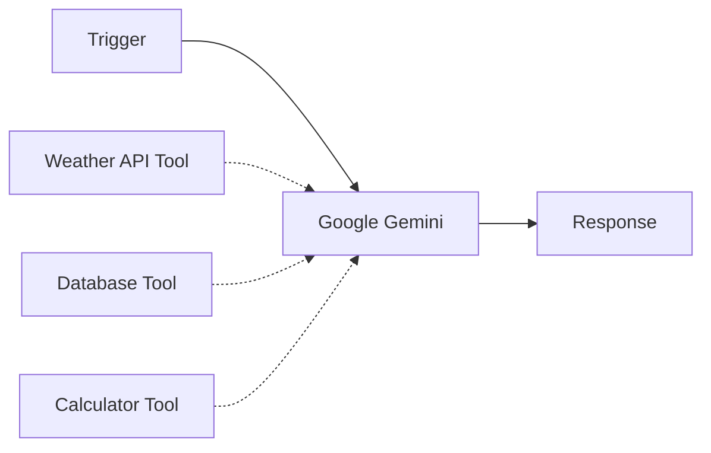
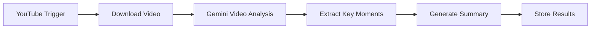
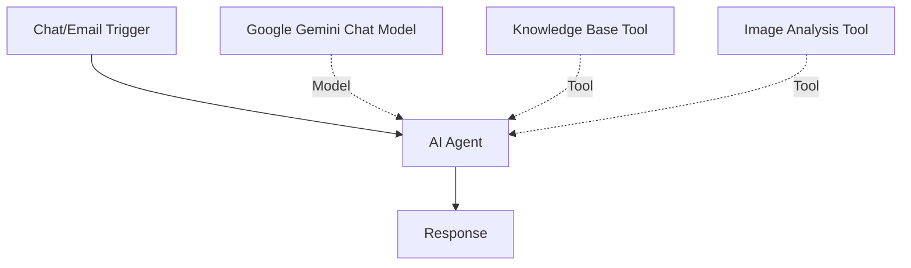
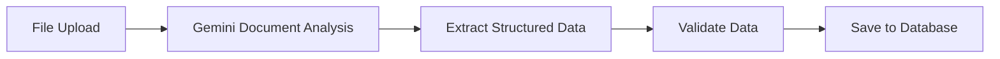
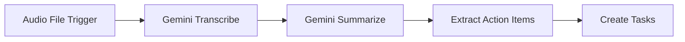
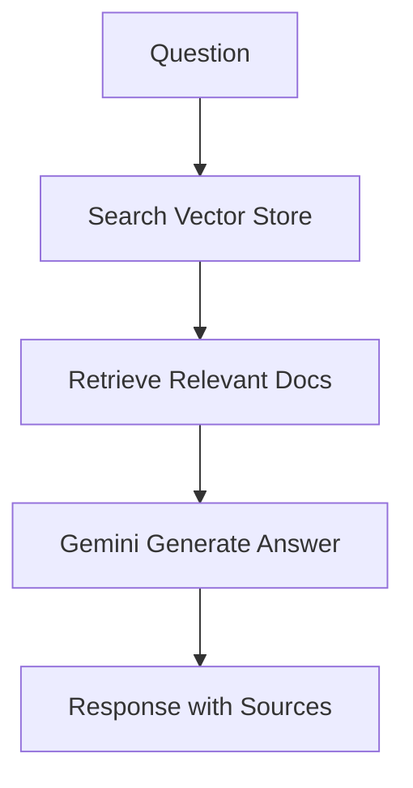

# Google Gemini Integration

The Google Gemini integration brings Google's most advanced AI models to n8n, offering powerful multimodal capabilities that can understand and generate text, analyze images, process audio, and even work with video content.

## Available Nodes

<CardGroup cols={2}>
  <Card title="Google Gemini Node" icon="robot" href="#google-gemini-node">
    Direct access to Gemini for text, image, audio, video, and document operations
  </Card>
  <Card title="Google Gemini Chat Model" icon="comments" href="#google-gemini-chat-model">
    Use Gemini with AI Agent for advanced workflows with tools and memory
  </Card>
</CardGroup>

## Prerequisites

Before you begin, you'll need:

- A Google Cloud account or Google AI Studio account
- A Google Gemini API key
- (Optional) Google Cloud project with Vertex AI enabled for production use

## Setup

<Steps>
  <Step title="Get Your API Key">
    **Option 1: Google AI Studio (Recommended for getting started)**
    1. Go to [Google AI Studio](https://makersuite.google.com/app/apikey)
    2. Click **Get API Key**
    3. Create a new key or use an existing one
    4. Copy the API key
    
    **Option 2: Google Cloud Console (For production)**
    1. Go to [Google Cloud Console](https://console.cloud.google.com/)
    2. Enable the Vertex AI API
    3. Create credentials for the API
    4. Copy the API key
  </Step>
  
  <Step title="Configure in n8n">
    1. Add a Google Gemini node to your workflow
    2. Click **Credential to connect with**
    3. Select **Create New Credential**
    4. Enter your API key
    5. (Optional) Set custom host URL for Vertex AI
    6. Click **Save**
  </Step>
  
  <Step title="Test the Connection">
    Send a simple text message to verify your credentials are working correctly.
  </Step>
</Steps>

## Google Gemini Node

The Google Gemini node provides comprehensive access to Gemini's multimodal capabilities across multiple resources.

### Available Resources

<Tabs>
  <Tab title="Text">
    Send messages to Gemini and receive intelligent responses.
    
    **Operations:**
    - **Message**: Send prompts and get responses from Gemini
    
    **Features:**
    - Multi-turn conversations
    - System instructions support
    - Tool/function calling
    - JSON mode for structured output
    - Safety settings configuration
    
    **Example Configuration:**
    ```json
    {
      "resource": "text",
      "operation": "message",
      "modelId": "gemini-2.0-flash",
      "messages": [
        {
          "content": "Explain how neural networks work in simple terms",
          "role": "user"
        }
      ]
    }
    ```
    
    **Available Roles:**
    - **User**: Send messages as the user
    - **Model**: Set Gemini's response style
  </Tab>
  
  <Tab title="Image">
    Analyze and generate images using Gemini's vision capabilities.
    
    **Operations:**
    - **Analyze**: Understand and describe images
    - **Generate**: Create images from text descriptions (Imagen)
    - **Edit**: Modify existing images
    
    **Vision Capabilities:**
    - Image description and captioning
    - Object detection and identification
    - Text extraction (OCR)
    - Scene understanding
    - Visual question answering
    - Spatial reasoning
    
    **Supported Formats:**
    - JPEG, PNG, WebP, HEIC, HEIF
    - Base64 encoded images
    - Image URLs
    - Binary image data
    
    **Example:**
    ```json
    {
      "resource": "image",
      "operation": "analyze",
      "modelId": "gemini-2.0-flash",
      "prompt": "Describe this image in detail and identify all objects",
      "binaryPropertyName": "data"
    }
    ```
    
    <Note>
      Gemini Pro Vision and Gemini 1.5+ models have excellent multimodal understanding capabilities.
    </Note>
  </Tab>
  
  <Tab title="Audio">
    Process and understand audio content.
    
    **Operations:**
    - **Analyze**: Understand audio context and content
    - **Transcribe**: Convert speech to text
    
    **Capabilities:**
    - Speech transcription
    - Audio content understanding
    - Music and sound identification
    - Emotion and tone detection
    - Multi-language support
    
    **Supported Formats:**
    - WAV, FLAC, MP3
    - AAC, OGG, OPUS
    - Binary audio data
    
    **Example:**
    ```json
    {
      "resource": "audio",
      "operation": "transcribe",
      "modelId": "gemini-2.0-flash",
      "binaryPropertyName": "data"
    }
    ```
    
    <Note>
      Audio understanding is available in Gemini 1.5 Pro and later models.
    </Note>
  </Tab>
  
  <Tab title="Video">
    Analyze and generate video content.
    
    **Operations:**
    - **Analyze**: Understand video content
    - **Generate**: Create videos from descriptions (Veo)
    - **Download**: Download generated videos
    
    **Video Analysis Capabilities:**
    - Scene understanding
    - Object tracking
    - Action recognition
    - Visual question answering about videos
    - Temporal reasoning
    
    **Supported Formats:**
    - MP4, MOV, AVI
    - WebM, FLV, MKV
    - Video URLs
    - Binary video data
    
    **Example:**
    ```json
    {
      "resource": "video",
      "operation": "analyze",
      "modelId": "gemini-2.0-flash",
      "prompt": "Summarize what happens in this video",
      "binaryPropertyName": "data"
    }
    ```
    
    <Note>
      Video understanding is a unique strength of Gemini 1.5 Pro with support for hours of video.
    </Note>
  </Tab>
  
  <Tab title="Document">
    Analyze documents and extract information.
    
    **Operations:**
    - **Analyze**: Extract information and insights from documents
    
    **Supported Formats:**
    - PDF documents
    - Text files
    - Google Docs
    - Markdown files
    - HTML documents
    
    **Use Cases:**
    - Document summarization
    - Information extraction
    - Contract analysis
    - Research paper review
    - Data extraction from forms
    
    **Example:**
    ```json
    {
      "resource": "document",
      "operation": "analyze",
      "modelId": "gemini-2.0-flash",
      "prompt": "Extract all dates, names, and amounts from this invoice",
      "binaryPropertyName": "data"
    }
    ```
  </Tab>
  
  <Tab title="Media File">
    Upload and manage media files for use with Gemini.
    
    **Operations:**
    - **Upload**: Upload files to Google's servers
    
    **Supported File Types:**
    - Images (JPEG, PNG, etc.)
    - Audio (MP3, WAV, etc.)
    - Video (MP4, MOV, etc.)
    - Documents (PDF, TXT, etc.)
    
    **Benefits:**
    - Reuse files across multiple requests
    - Handle large files more efficiently
    - Better for video and audio processing
    
    **Example:**
    ```json
    {
      "resource": "file",
      "operation": "upload",
      "binaryPropertyName": "data",
      "fileName": "video.mp4",
      "mimeType": "video/mp4"
    }
    ```
  </Tab>
  
  <Tab title="File Search">
    Create and manage vector stores for semantic search.
    
    **Operations:**
    - **Create Store**: Create a new vector store
    - **Upload to Store**: Add documents to a store
    - **List Stores**: View all your vector stores
    - **Delete Store**: Remove a vector store
    
    **Use Cases:**
    - Knowledge base search
    - Document retrieval
    - Semantic search across documents
    - RAG (Retrieval Augmented Generation)
    
    **Example:**
    ```json
    {
      "resource": "fileSearch",
      "operation": "createStore",
      "storeName": "Company Knowledge Base"
    }
    ```
    
    <Note>
      File search enables powerful RAG workflows where Gemini can search through your document collections.
    </Note>
  </Tab>
</Tabs>

### Gemini Models

Google offers several Gemini models with different capabilities:

| Model | Best For | Context Window | Key Features |
|-------|----------|----------------|-------------|
| **gemini-2.0-flash** | Latest, fastest | 1M tokens | Multimodal, fast responses, cost-effective |
| **gemini-1.5-pro** | Advanced reasoning | 2M tokens | Best quality, longest context, video understanding |
| **gemini-1.5-flash** | Balanced performance | 1M tokens | Fast, multimodal, good quality |
| **gemini-1.0-pro** | Legacy tasks | 32K tokens | Text-only, baseline model |

<Note>
  Gemini 1.5 Pro has the longest context window of any large language model at 2 million tokens, allowing it to process entire codebases, long videos, and large document collections.
</Note>

### Advanced Features

#### Tool Use (Function Calling)

Connect tools to Gemini for dynamic interactions:

1. Connect tool nodes to the **Tools** input
2. Gemini will automatically decide when to use tools
3. Tools execute and return results
4. Gemini incorporates results in its response



#### Built-in Tools

Gemini supports built-in tools for specific capabilities:

**Code Execution:**
Allow Gemini to write and run Python code:

```json
{
  "builtInTools": {
    "codeExecution": true
  }
}
```

**Google Search:**
Enable Gemini to search the web for current information:

```json
{
  "builtInTools": {
    "googleSearch": true
  }
}
```

#### JSON Mode

Request structured JSON output:

```json
{
  "responseFormat": "json",
  "prompt": "Extract the name, email, and phone from this text as JSON"
}
```

#### Safety Settings

Control content safety thresholds:

```json
{
  "safetySettings": [
    {
      "category": "HARM_CATEGORY_HARASSMENT",
      "threshold": "BLOCK_MEDIUM_AND_ABOVE"
    }
  ]
}
```

#### System Instructions

Set Gemini's behavior and context:

```json
{
  "systemInstruction": "You are a helpful data analyst specializing in Python and SQL. Always provide code examples with explanations."
}
```

## Google Gemini Chat Model

The Google Gemini Chat Model node is designed for use with LangChain components, particularly the AI Agent.

### Setup with AI Agent

<Steps>
  <Step title="Add Chat Model">
    Add the **Google Gemini Chat Model** node to your workflow.
  </Step>
  
  <Step title="Select Model">
    Choose the appropriate Gemini model:
    - **gemini-2.0-flash**: Latest, fastest, great for most tasks
    - **gemini-1.5-pro**: Maximum capability, longest context
    - **gemini-1.5-flash**: Balanced speed and quality
  </Step>
  
  <Step title="Configure Parameters">
    Set temperature, max tokens, and other options:
    
    ```json
    {
      "temperature": 0.7,
      "maxTokens": 8192,
      "topP": 0.95,
      "topK": 40
    }
    ```
  </Step>
  
  <Step title="Connect to AI Agent">
    Wire the chat model to an AI Agent:
    
    ```mermaid
    graph LR
        A[Trigger] --> B[AI Agent]
        C[Google Gemini Chat Model] -.Model.-> B
        D[Memory] -.Memory.-> B
        E[Tools] -.Tools.-> B
        B --> F[Output]
    ```
  </Step>
</Steps>

### Model Parameters

<CodeGroup>
```json Basic Configuration
{
  "model": "gemini-2.0-flash",
  "temperature": 0.7,
  "maxTokens": 8192
}
```

```json Advanced Configuration
{
  "model": "gemini-1.5-pro",
  "temperature": 0.5,
  "maxTokens": 8192,
  "topP": 0.95,
  "topK": 40,
  "stopSequences": ["END"],
  "safetySettings": [
    {
      "category": "HARM_CATEGORY_DANGEROUS_CONTENT",
      "threshold": "BLOCK_MEDIUM_AND_ABOVE"
    }
  ]
}
```
</CodeGroup>

## Common Use Cases

### 1. Video Content Analysis

Analyze video content automatically:



### 2. Multimodal Customer Support

Handle text, image, and document queries:



### 3. Document Processing Pipeline

Extract and process document data:



### 4. Audio Transcription Workflow

Transcribe and analyze audio:



### 5. RAG with File Search

Build a retrieval-augmented generation system:



## Best Practices

<Steps>
  <Step title="Choose the Right Model">
    - **gemini-2.0-flash**: Fast responses, most tasks
    - **gemini-1.5-pro**: Complex reasoning, long context
    - **gemini-1.5-flash**: Balanced performance
  </Step>
  
  <Step title="Leverage Multimodal Capabilities">
    - Combine text, images, audio, and video in single prompts
    - Use video understanding for long-form content
    - Process documents with visual elements effectively
  </Step>
  
  <Step title="Optimize Context Usage">
    - Gemini supports massive context (up to 2M tokens)
    - Use for long documents and entire codebases
    - Consider chunking only for processing speed
  </Step>
  
  <Step title="Use Built-in Tools">
    - Enable code execution for math and data analysis
    - Use Google Search for current information
    - Combine with custom tools for powerful agents
  </Step>
  
  <Step title="Configure Safety Settings">
    - Set appropriate thresholds for your use case
    - Monitor filtered responses
    - Adjust as needed for your application
  </Step>
</Steps>

## Troubleshooting

### Rate Limits

If you encounter rate limits:

1. Implement exponential backoff
2. Reduce request frequency
3. Upgrade to higher quota tier
4. Use batch processing

### Context Length Errors

If inputs are too long:

1. Check total token count
2. Use Gemini 1.5 Pro for longer context (2M tokens)
3. Chunk inputs if necessary
4. Remove redundant information

### Media Processing Errors

If media files fail to process:

1. Verify file format is supported
2. Check file size limits
3. Upload large files using the File API first
4. Ensure proper encoding

### Tool Calling Issues

If tools aren't working:

1. Verify tool connections
2. Check tool descriptions are clear
3. Test tools independently
4. Review tool output format

### Safety Filter Blocks

If responses are filtered:

1. Review safety settings
2. Adjust thresholds if appropriate
3. Rephrase prompts
4. Check content guidelines

## Resources

- [Google AI Studio](https://makersuite.google.com/)
- [Gemini API Documentation](https://ai.google.dev/docs)
- [Vertex AI Documentation](https://cloud.google.com/vertex-ai/docs)
- [Gemini Models Overview](https://ai.google.dev/models/gemini)
- [n8n AI Agent Documentation](/ai/agents)
- [n8n Community Forum](https://community.n8n.io/)
