# LangChain Integration

LangChain is a framework for developing applications powered by language models. n8n provides comprehensive integration with LangChain, allowing you to build sophisticated AI workflows with agents, chains, tools, memory, and more.

## Overview

The n8n LangChain integration includes:

<CardGroup cols={2}>
  <Card title="AI Agents" icon="robot" href="#ai-agents">
    Autonomous agents that can reason, plan, and use tools
  </Card>
  <Card title="Chains" icon="link" href="#chains">
    Sequential processing pipelines for AI tasks
  </Card>
  <Card title="Chat Models" icon="comments" href="#chat-models">
    Connect to various LLM providers
  </Card>
  <Card title="Tools" icon="wrench" href="#tools">
    Extend agent capabilities with custom tools
  </Card>
  <Card title="Memory" icon="brain" href="#memory">
    Maintain conversation context and history
  </Card>
  <Card title="Vector Stores" icon="database" href="#vector-stores">
    Store and retrieve embeddings for RAG
  </Card>
</CardGroup>

## Core Concepts

### LangChain in n8n

n8n implements LangChain concepts as interconnected nodes:

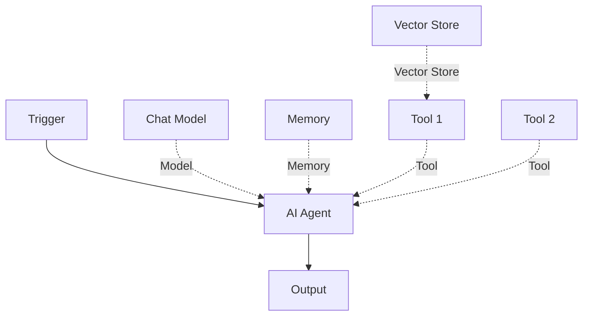

**Node Types:**
- **Root Nodes**: Execute and produce outputs (AI Agent, Chain LLM)
- **Sub-Nodes**: Provide capabilities to root nodes (Chat Model, Memory, Tools)
- **Connection Types**: Different input types (Model, Memory, Tool, Vector Store)

## AI Agents

AI Agents are autonomous systems that can reason, plan, and execute tasks using connected tools.

### AI Agent Node

The AI Agent is the most powerful LangChain node in n8n.

<Steps>
  <Step title="Add AI Agent Node">
    Add the **AI Agent** node to your workflow as a root node.
  </Step>
  
  <Step title="Connect a Chat Model">
    Connect a chat model node to the **Model** input:
    - OpenAI Chat Model
    - Anthropic Chat Model
    - Google Gemini Chat Model
    - Other LLM providers
  </Step>
  
  <Step title="Add Tools (Optional)">
    Connect tool nodes to the **Tools** input:
    - HTTP Request Tool
    - Code Tool
    - Calculator Tool
    - Custom n8n Tools
    - Vector Store Retrieval Tool
  </Step>
  
  <Step title="Add Memory (Optional)">
    Connect a memory node to the **Memory** input:
    - Buffer Memory
    - Window Buffer Memory
    - Conversation Summary Memory
  </Step>
  
  <Step title="Configure Options">
    Set agent options:
    - System message
    - Prompt type
    - Max iterations
    - Return intermediate steps
  </Step>
</Steps>

### Agent Types

<Tabs>
  <Tab title="Conversational Agent">
    Best for chat-based interactions with natural conversation flow.
    
    **Features:**
    - Multi-turn conversations
    - Memory integration
    - Natural language understanding
    - Tool selection based on context
    
    **Use Cases:**
    - Customer support chatbots
    - Virtual assistants
    - Interactive Q&A systems
    
    **Example Configuration:**
    ```json
    {
      "promptType": "conversational",
      "systemMessage": "You are a helpful assistant that can search the web and access our database."
    }
    ```
  </Tab>
  
  <Tab title="ReAct Agent">
    Reasoning and Acting agent that explicitly shows its thought process.
    
    **Features:**
    - Clear reasoning steps
    - Action planning
    - Observation feedback
    - Iterative problem solving
    
    **Use Cases:**
    - Complex problem solving
    - Multi-step workflows
    - Debugging and troubleshooting
    
    **Example:**
    ```
    Thought: I need to find the weather in San Francisco
    Action: search_web
    Action Input: "San Francisco weather today"
    Observation: It's 72°F and sunny
    Thought: Now I have the answer
    Final Answer: The weather in San Francisco is 72°F and sunny today.
    ```
  </Tab>
  
  <Tab title="OpenAI Functions Agent">
    Uses OpenAI's native function calling for reliable tool use.
    
    **Features:**
    - Structured tool calling
    - Parallel function execution
    - High reliability
    - Better error handling
    
    **Use Cases:**
    - API integrations
    - Database operations
    - Structured workflows
    
    **Requirements:**
    - OpenAI Chat Model
    - Function-calling enabled model (GPT-3.5-turbo+)
  </Tab>
  
  <Tab title="Plan and Execute Agent">
    Plans the entire workflow upfront, then executes step by step.
    
    **Features:**
    - Strategic planning
    - Sequential execution
    - Better for complex tasks
    - Can revise plans
    
    **Use Cases:**
    - Research tasks
    - Multi-step projects
    - Complex data processing
    
    **Example:**
    ```
    Plan:
    1. Search for company information
    2. Extract key metrics
    3. Compare with competitors
    4. Generate report
    
    Execution: [Executes each step]
    ```
  </Tab>
</Tabs>

### Agent Configuration

<CodeGroup>
```json Basic Configuration
{
  "systemMessage": "You are a helpful AI assistant.",
  "promptType": "conversational",
  "maxIterations": 10
}
```

```json Advanced Configuration
{
  "systemMessage": "You are a data analyst specializing in Python and SQL. Always show your work.",
  "promptType": "react",
  "maxIterations": 15,
  "returnIntermediateSteps": true,
  "options": {
    "temperature": 0.7,
    "maxTokens": 4096
  }
}
```
</CodeGroup>

## Chains

Chains are sequential processing pipelines that connect multiple LangChain components.

### Chain LLM Node

Simple chain for basic LLM tasks without agent complexity.

**Use Cases:**
- Simple text generation
- Template-based responses
- Single-step processing
- Faster than agents

**Example:**
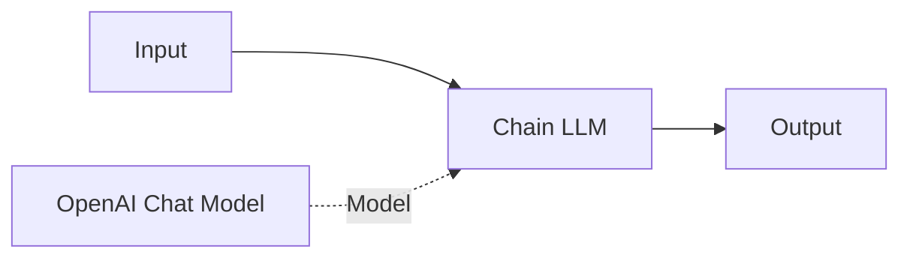

### Chain Retrieval QA Node

Question-answering chain with vector store retrieval (RAG).

**Components:**
- Vector Store Retrieval Tool
- Chat Model
- (Optional) Memory

**Example:**
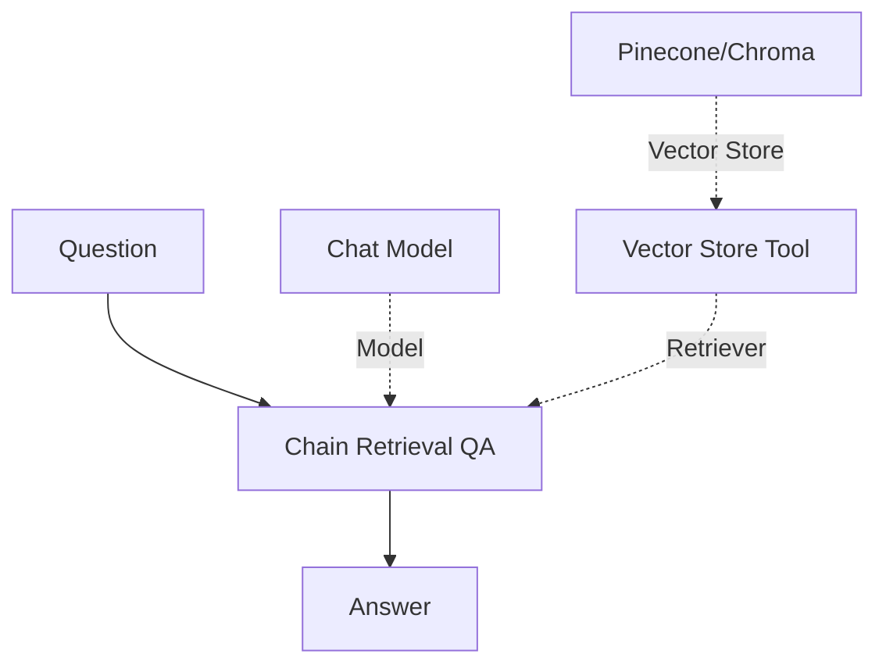

**Configuration:**
```json
{
  "returnSourceDocuments": true,
  "topK": 4,
  "options": {
    "chainType": "stuff"
  }
}
```

## Chat Models

Chat models are the LLM providers that power your agents and chains.

### Available Chat Models

<Tabs>
  <Tab title="OpenAI">
    **Node:** OpenAI Chat Model
    
    **Models:**
    - GPT-4 Turbo (most capable)
    - GPT-4 (balanced)
    - GPT-3.5 Turbo (fast and economical)
    - o1/o3 (advanced reasoning)
    
    **Features:**
    - Function calling
    - JSON mode
    - Vision (GPT-4 Turbo)
    - 128K context (GPT-4 Turbo)
    
    [Learn more →](/integrations/ai/openai#openai-chat-model)
  </Tab>
  
  <Tab title="Anthropic">
    **Node:** Anthropic Chat Model
    
    **Models:**
    - Claude 3.5 Sonnet (latest)
    - Claude 3 Opus (most capable)
    - Claude 3 Sonnet (balanced)
    - Claude 3 Haiku (fast)
    
    **Features:**
    - 200K context window
    - Tool use
    - Vision
    - High accuracy
    
    [Learn more →](/integrations/ai/anthropic#anthropic-chat-model)
  </Tab>
  
  <Tab title="Google Gemini">
    **Node:** Google Gemini Chat Model
    
    **Models:**
    - Gemini 2.0 Flash (latest)
    - Gemini 1.5 Pro (most capable)
    - Gemini 1.5 Flash (balanced)
    
    **Features:**
    - 2M context (Gemini 1.5 Pro)
    - Multimodal (text, image, audio, video)
    - Code execution
    - Google Search integration
    
    [Learn more →](/integrations/ai/google-gemini#google-gemini-chat-model)
  </Tab>
  
  <Tab title="Other Providers">
    **Available Integrations:**
    - **Ollama**: Local LLM deployment
    - **Azure OpenAI**: Enterprise OpenAI
    - **Cohere**: Multilingual models
    - **HuggingFace**: Open source models
    - **Mistral**: European AI models
    - **Groq**: Ultra-fast inference
    - **AWS Bedrock**: AWS-hosted models
    
    Each provider has specific strengths and use cases.
  </Tab>
</Tabs>

## Tools

Tools extend agent capabilities by giving them access to external systems and functions.

### Built-in Tools

<CardGroup cols={2}>
  <Card title="HTTP Request Tool">
    Make API calls to external services
    - RESTful APIs
    - Authentication support
    - Custom headers
  </Card>
  <Card title="Code Tool">
    Execute JavaScript or Python code
    - Data transformation
    - Custom logic
    - Library access
  </Card>
  <Card title="Calculator Tool">
    Perform mathematical calculations
    - Basic arithmetic
    - Complex expressions
    - Numeric operations
  </Card>
  <Card title="Vector Store Tool">
    Search vector databases
    - Semantic search
    - RAG workflows
    - Document retrieval
  </Card>
</CardGroup>

### Custom n8n Tools

Create custom tools using any n8n workflow:

<Steps>
  <Step title="Create Tool Workflow">
    Build a workflow that performs your tool's function.
  </Step>
  
  <Step title="Add Workflow Tool Node">
    Add the **Workflow Tool** node to your agent workflow.
  </Step>
  
  <Step title="Configure Tool">
    - Select the tool workflow
    - Set tool name and description
    - Define input/output schema
  </Step>
  
  <Step title="Connect to Agent">
    Connect the tool to your AI Agent's **Tools** input.
  </Step>
</Steps>

**Example Tool Structure:**
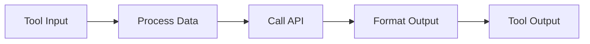

### Agent Tool (Sub-Agents)

Create multi-agent systems with specialized sub-agents:

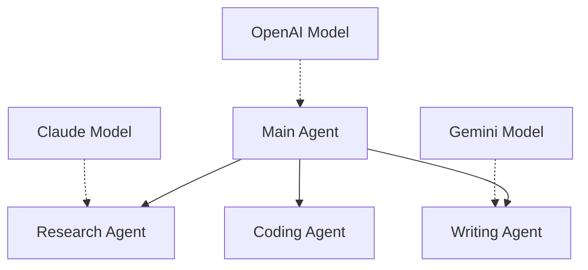

**Benefits:**
- Specialized expertise
- Different models for different tasks
- Parallel processing
- Modular architecture

## Memory

Memory allows agents to maintain context across multiple interactions.

### Memory Types

<Tabs>
  <Tab title="Buffer Memory">
    Stores all conversation history.
    
    **Features:**
    - Complete history
    - Simple implementation
    - No data loss
    
    **Use Cases:**
    - Short conversations
    - When full context is needed
    - Debugging
    
    **Configuration:**
    ```json
    {
      "memoryType": "buffer",
      "contextWindowLength": 5
    }
    ```
    
    **Limitations:**
    - Can exceed token limits
    - More expensive with long conversations
  </Tab>
  
  <Tab title="Window Buffer Memory">
    Keeps only the last N messages.
    
    **Features:**
    - Fixed memory size
    - Predictable token usage
    - Sliding window
    
    **Use Cases:**
    - Long conversations
    - Token management
    - Cost optimization
    
    **Configuration:**
    ```json
    {
      "memoryType": "windowBuffer",
      "windowSize": 10
    }
    ```
    
    **Recommended Settings:**
    - Short conversations: 5-10 messages
    - Medium conversations: 10-20 messages
    - Long conversations: 20-50 messages
  </Tab>
  
  <Tab title="Summary Memory">
    Summarizes old messages to save tokens.
    
    **Features:**
    - Compressed history
    - Token efficient
    - Retains key information
    
    **Use Cases:**
    - Very long conversations
    - Complex context
    - Cost-sensitive applications
    
    **Configuration:**
    ```json
    {
      "memoryType": "summary",
      "maxTokenLimit": 2000
    }
    ```
    
    **How it works:**
    1. Keeps recent messages as-is
    2. Summarizes older messages
    3. Updates summary as conversation grows
  </Tab>
  
  <Tab title="Redis Memory">
    Persistent memory stored in Redis.
    
    **Features:**
    - Persistent across sessions
    - Scalable
    - Shared across instances
    
    **Use Cases:**
    - Multi-session conversations
    - Production deployments
    - User-specific context
    
    **Configuration:**
    ```json
    {
      "memoryType": "redis",
      "sessionId": "user_123",
      "redisUrl": "redis://localhost:6379"
    }
    ```
  </Tab>
</Tabs>

## Vector Stores

Vector stores enable semantic search and retrieval-augmented generation (RAG).

### Available Vector Stores

<CardGroup cols={2}>
  <Card title="Pinecone">
    Managed vector database
    - Fully managed
    - Fast and scalable
    - Easy setup
  </Card>
  <Card title="Chroma">
    Open source vector store
    - Self-hosted option
    - Great for development
    - Cost-effective
  </Card>
  <Card title="Qdrant">
    High-performance vector search
    - Fast queries
    - Advanced filtering
    - Self-hosted or cloud
  </Card>
  <Card title="Supabase">
    PostgreSQL with vectors
    - Familiar SQL interface
    - Integrated with Supabase
    - Good for small datasets
  </Card>
</CardGroup>

### RAG Workflow

Build a Retrieval-Augmented Generation system:

<Steps>
  <Step title="Prepare Documents">
    ```mermaid
    graph LR
        A[Documents] --> B[Text Splitter]
        B --> C[Embeddings]
        C --> D[Vector Store]
    ```
  </Step>
  
  <Step title="Create Retrieval Tool">
    Add a Vector Store Retrieval Tool that searches your vector store.
  </Step>
  
  <Step title="Connect to Agent">
    Wire the retrieval tool to your AI Agent's tools input.
  </Step>
  
  <Step title="Query with Context">
    The agent automatically retrieves relevant documents and uses them to answer questions.
  </Step>
</Steps>

**Complete RAG Example:**
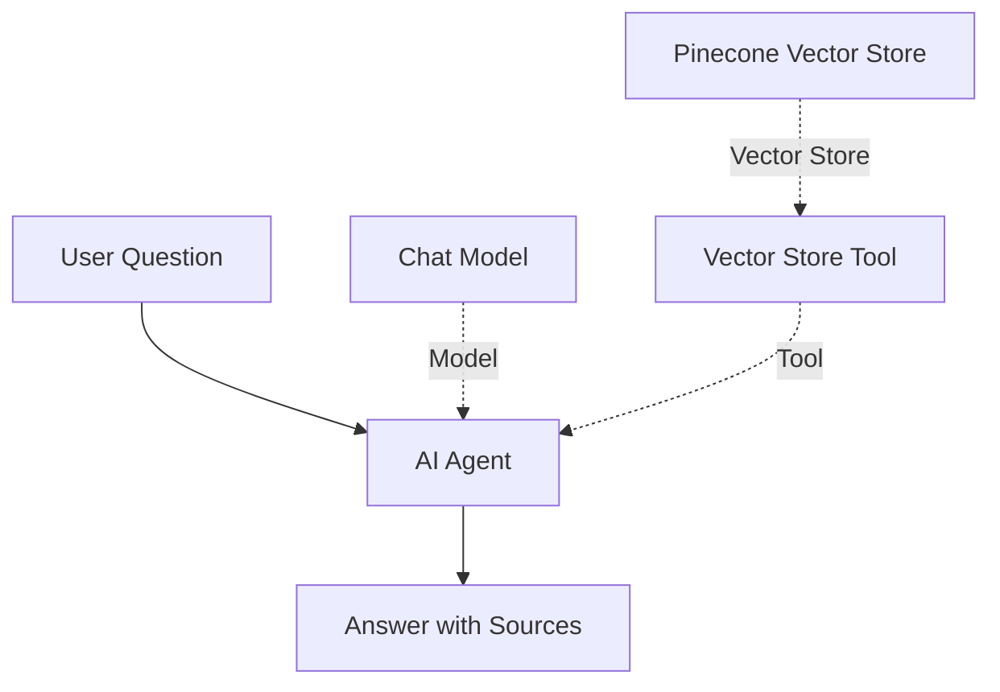

## Common Patterns

### 1. Simple Q&A Agent

Basic conversational agent:

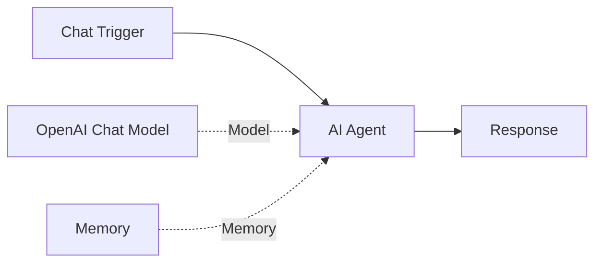

### 2. Research Agent

Agent with web search:

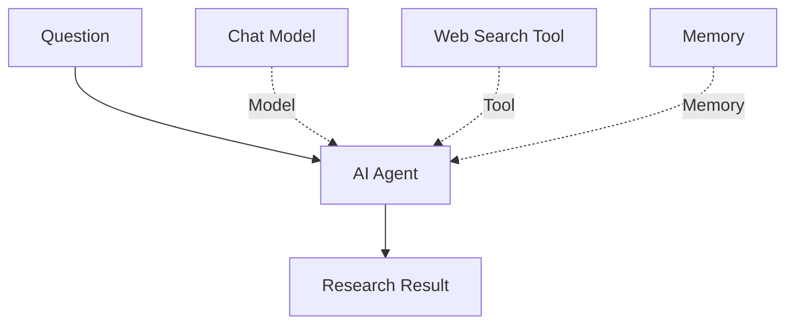

### 3. Data Analysis Agent

Agent with code execution:

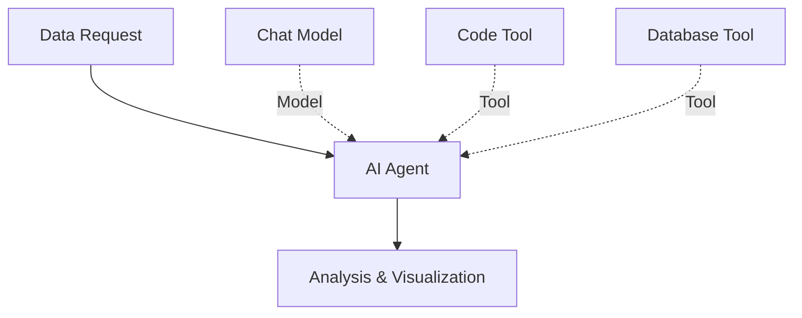

### 4. Customer Support Agent

Full-featured support agent:

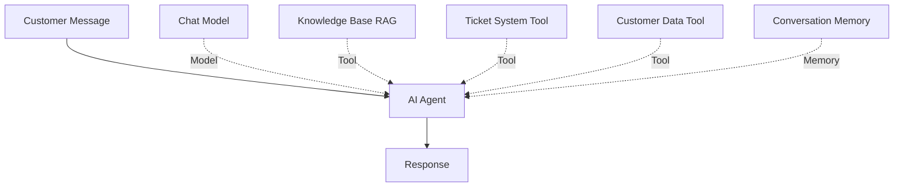

### 5. Multi-Agent System

Orchestrator with specialized agents:

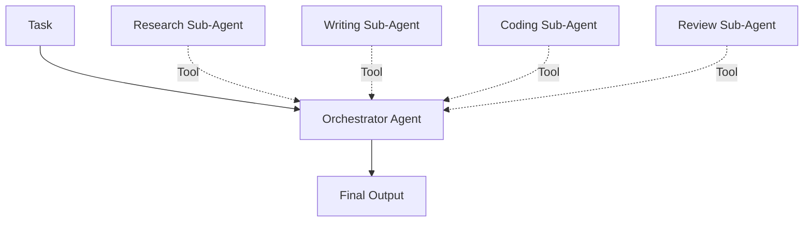

## Best Practices

<Steps>
  <Step title="Start Simple">
    Begin with a basic agent and add complexity gradually:
    1. Single chat model
    2. Add memory
    3. Add one tool
    4. Add more tools as needed
  </Step>
  
  <Step title="Write Clear Tool Descriptions">
    Tools are selected based on descriptions:
    - Be specific about what the tool does
    - Include when to use it
    - Mention input/output format
    - Give examples if helpful
  </Step>
  
  <Step title="Manage Context Windows">
    - Use appropriate memory types
    - Consider token limits
    - Summarize when needed
    - Choose models with larger context for complex tasks
  </Step>
  
  <Step title="Handle Errors Gracefully">
    - Implement retry logic
    - Provide fallback options
    - Log agent reasoning
    - Monitor tool failures
  </Step>
  
  <Step title="Optimize for Cost">
    - Use cheaper models when possible
    - Limit max iterations
    - Cache results
    - Use window buffer memory
    - Monitor token usage
  </Step>
  
  <Step title="Test Tools Independently">
    - Verify each tool works correctly
    - Test error cases
    - Check output formats
    - Ensure consistent behavior
  </Step>
</Steps>

## Troubleshooting

### Agent Not Using Tools

**Possible causes:**
- Tool descriptions unclear
- Wrong prompt type
- Model doesn't support function calling
- System message overriding tool use

**Solutions:**
1. Improve tool descriptions
2. Use "tools" or "openai-functions" prompt type
3. Use compatible model (GPT-3.5-turbo+, Claude 3+, etc.)
4. Adjust system message

### Agent Loops or Doesn't Finish

**Possible causes:**
- Tool returns unclear results
- Max iterations too high
- Circular dependencies
- Poor prompt engineering

**Solutions:**
1. Lower max iterations (try 10-15)
2. Improve tool output clarity
3. Review agent reasoning (enable intermediate steps)
4. Refine system prompt

### Memory Not Working

**Possible causes:**
- Memory not connected
- Session ID not set
- Memory type mismatch
- Context window exceeded

**Solutions:**
1. Verify memory connection
2. Set consistent session IDs
3. Use window buffer for long conversations
4. Check token usage

### RAG Returns Irrelevant Results

**Possible causes:**
- Poor document chunking
- Embedding model mismatch
- Top K too low
- Query not specific enough

**Solutions:**
1. Adjust chunk size and overlap
2. Use same embedding model consistently
3. Increase top K (try 5-10)
4. Improve query formulation

## Resources

- [LangChain Documentation](https://python.langchain.com/docs/get_started/introduction)
- [n8n AI Documentation](/ai/overview)
- [n8n LangChain Nodes Reference](/ai/langchain-nodes)
- [n8n Community Forum - AI Section](https://community.n8n.io/c/ai/)
- [LangChain Concepts](https://python.langchain.com/docs/concepts)
