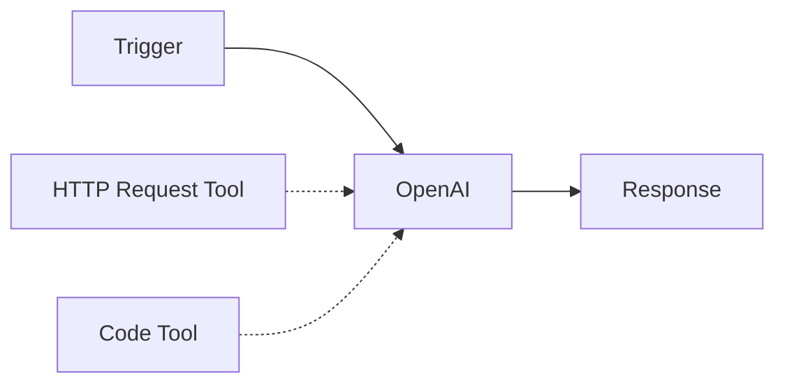
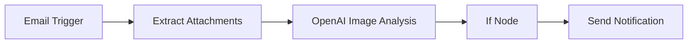
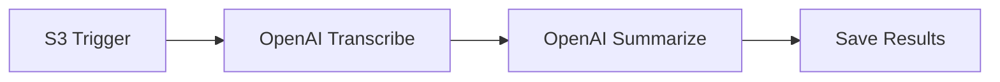
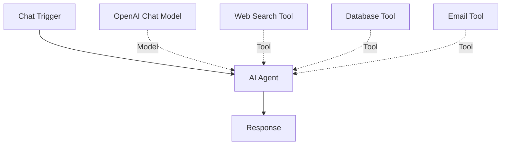

# OpenAI Integration

The OpenAI integration allows you to leverage OpenAI's powerful AI models including GPT-4, DALL-E, Whisper, and Sora for a variety of tasks including text generation, image generation and analysis, audio transcription and generation, and video generation.

## Available Nodes

n8n provides two types of OpenAI nodes:

<CardGroup cols={2}>
  <Card title="OpenAI Node" icon="robot" href="#openai-node">
    Specialized operations: image generation (DALL-E), audio (Whisper, TTS), and video generation (Sora)
  </Card>
  <Card title="OpenAI Chat Model" icon="comments" href="#openai-chat-model">
    For text generation, reasoning, and tools - use with AI Agent
  </Card>
</CardGroup>

<Note>
  For most text generation and LLM tasks, use the **AI Agent** node with **OpenAI Chat Model** instead of the standalone OpenAI node. The OpenAI node is optimized for specialized operations like image, audio, and video generation.
</Note>

## Prerequisites

Before you begin, you'll need:

- An OpenAI account
- An OpenAI API key (get one from [OpenAI Platform](https://platform.openai.com/api-keys))
- Sufficient API credits in your OpenAI account

## Setup

<Steps>
  <Step title="Create OpenAI API Credentials">
    1. Go to the [OpenAI API Keys page](https://platform.openai.com/api-keys)
    2. Click "Create new secret key"
    3. Give your key a name and copy it immediately (you won't be able to see it again)
    4. Store the key securely
  </Step>
  
  <Step title="Add Credentials in n8n">
    1. In your n8n workflow, add an OpenAI node
    2. Click on the **Credential to connect with** dropdown
    3. Click **Create New Credential**
    4. Paste your API key
    5. (Optional) Configure custom base URL if using a proxy
    6. Click **Save**
  </Step>
  
  <Step title="Test the Connection">
    Test your credentials by running a simple operation to ensure everything is configured correctly.
  </Step>
</Steps>

## OpenAI Node

The OpenAI node provides specialized operations for image, audio, and video generation. It supports multiple resources and operations.

### Available Resources

<Tabs>
  <Tab title="Text">
    Generate text responses and perform classifications using GPT models.
    
    **Operations:**
    - **Message**: Send messages to GPT models and get responses
    - **Classify**: Classify text using moderation models
    
    **Example Use Cases:**
    - Generate text completions
    - Content moderation
    - Multi-turn conversations
    - Structured output with JSON mode
  </Tab>
  
  <Tab title="Image">
    Generate and analyze images using DALL-E and GPT-4 Vision.
    
    **Operations:**
    - **Generate**: Create images from text descriptions using DALL-E
    - **Analyze**: Analyze images using GPT-4 Vision
    - **Edit**: Edit existing images with DALL-E 2
    
    **Supported Models:**
    - DALL-E 3 (latest, highest quality)
    - DALL-E 2 (classic, more variations)
    - GPT Image 1 (new image generation model)
    
    **Example:**
    ```json
    {
      "resource": "image",
      "operation": "generate",
      "model": "dall-e-3",
      "prompt": "A serene mountain landscape at sunset",
      "options": {
        "size": "1024x1024",
        "quality": "hd",
        "style": "vivid"
      }
    }
    ```
  </Tab>
  
  <Tab title="Audio">
    Generate speech and transcribe audio using Whisper and TTS.
    
    **Operations:**
    - **Generate**: Text-to-speech conversion
    - **Transcribe**: Convert speech to text (Whisper)
    - **Translate**: Translate audio to English
    
    **TTS Voices:**
    - alloy, echo, fable, onyx, nova, shimmer
    
    **Whisper Models:**
    - whisper-1 (high accuracy speech recognition)
    
    **Example:**
    ```json
    {
      "resource": "audio",
      "operation": "transcribe",
      "model": "whisper-1",
      "binaryPropertyName": "data"
    }
    ```
  </Tab>
  
  <Tab title="Video">
    Generate videos using Sora (when available).
    
    **Operations:**
    - **Generate**: Create videos from text descriptions
    
    **Models:**
    - sora-1 (latest video generation model)
    
    <Note>
      Video generation with Sora requires special access. Check [OpenAI's documentation](https://openai.com/sora) for availability.
    </Note>
  </Tab>
  
  <Tab title="Assistant">
    Work with OpenAI Assistants API.
    
    **Operations:**
    - **Create**: Create a new assistant
    - **Message**: Send messages to an assistant
    - **Update**: Update assistant settings
    - **Delete**: Remove an assistant
    - **List**: List all assistants
    
    **Features:**
    - Persistent conversations
    - Code interpreter
    - File search
    - Function calling
  </Tab>
  
  <Tab title="File">
    Manage files for use with assistants and fine-tuning.
    
    **Operations:**
    - **Upload**: Upload files to OpenAI
    - **List**: List uploaded files
    - **Delete**: Remove files
    
    **Supported Purposes:**
    - assistants (for assistant file search)
    - fine-tune (for model fine-tuning)
  </Tab>
  
  <Tab title="Conversation">
    Manage conversation threads with assistants.
    
    **Operations:**
    - **Create**: Start a new conversation
    - **Get**: Retrieve conversation details
    - **Update**: Modify conversation metadata
    - **Remove**: Delete a conversation
  </Tab>
</Tabs>

### Advanced Features

#### Function Calling / Tools

Connect custom n8n tools to the OpenAI node to enable function calling:

1. Add tool nodes to your workflow (e.g., HTTP Request Tool, Code Tool)
2. Connect them to the **Tools** input on the OpenAI node
3. OpenAI will automatically call these tools when needed



#### Structured Output

Use JSON mode or response format to get structured data:

```json
{
  "responseFormat": "json_object",
  "prompt": "Extract the name, email, and phone from this text as JSON: ..."
}
```

<Note>
  When using JSON mode, include the word "json" in your prompt and use models released after November 2023.
</Note>

#### Streaming Responses

Enable streaming for real-time responses:

```json
{
  "options": {
    "stream": true
  }
}
```

## OpenAI Chat Model

The OpenAI Chat Model node is designed for use with LangChain components, particularly the AI Agent.

### Configuration

<Steps>
  <Step title="Add Chat Model Node">
    Add the **OpenAI Chat Model** node to your workflow.
  </Step>
  
  <Step title="Select Model">
    Choose from available models:
    - **GPT-4 Turbo**: Most capable, best for complex tasks
    - **GPT-4**: High capability, balanced performance
    - **GPT-3.5 Turbo**: Fast and cost-effective
    - **o1/o3 models**: Advanced reasoning capabilities
  </Step>
  
  <Step title="Configure Options">
    Set temperature, max tokens, and other parameters:
    
    - **Temperature**: Controls randomness (0-2)
    - **Max Tokens**: Limit response length
    - **Top P**: Nucleus sampling parameter
    - **Frequency Penalty**: Reduce repetition
    - **Presence Penalty**: Encourage new topics
  </Step>
  
  <Step title="Connect to AI Agent">
    Connect the Chat Model to an AI Agent node:
    
    ```mermaid
    graph LR
        A[Trigger] --> B[AI Agent]
        C[OpenAI Chat Model] -.Model.-> B
        D[Memory] -.Memory.-> B
        E[Tools] -.Tools.-> B
    ```
  </Step>
</Steps>

### Model Selection

| Model | Best For | Context Window | Capabilities |
|-------|----------|----------------|-------------|
| GPT-4 Turbo | Complex reasoning, latest features | 128K tokens | Vision, JSON mode, function calling |
| GPT-4 | Balanced performance | 8K tokens | High accuracy, reliable |
| GPT-3.5 Turbo | Speed and cost | 16K tokens | Fast responses, good for simple tasks |
| o1-preview | Advanced reasoning | 128K tokens | Complex problem solving |
| o3-mini | Efficient reasoning | 128K tokens | Cost-effective reasoning |

### Response Formats

<CodeGroup>
```json Text Response
{
  "responseFormat": "text"
}
```

```json JSON Object
{
  "responseFormat": "json_object"
}
```

```json JSON Schema
{
  "responseFormat": "json_schema",
  "jsonSchema": {
    "type": "object",
    "properties": {
      "name": { "type": "string" },
      "age": { "type": "number" }
    },
    "required": ["name", "age"]
  }
}
```
</CodeGroup>

## Common Use Cases

### 1. Content Generation

Generate blog posts, product descriptions, or marketing copy:


### 2. Image Analysis Pipeline

Analyze images and take actions based on content:



### 3. Audio Transcription

Transcribe audio files and process the text:



### 4. AI Agent with Tools

Create an intelligent agent that can use multiple tools:



## Best Practices

<Steps>
  <Step title="Choose the Right Model">
    - Use GPT-4 for complex reasoning and high-quality outputs
    - Use GPT-3.5 Turbo for speed and cost efficiency
    - Use specialized models (DALL-E, Whisper) for specific tasks
  </Step>
  
  <Step title="Optimize Token Usage">
    - Set appropriate `max_tokens` limits
    - Use system messages to set context efficiently
    - Consider caching responses for repeated queries
  </Step>
  
  <Step title="Handle Errors Gracefully">
    - Implement retry logic for rate limits
    - Check error responses and handle them appropriately
    - Monitor API usage and costs
  </Step>
  
  <Step title="Use Streaming for Long Responses">
    - Enable streaming for better user experience
    - Process chunks as they arrive
    - Handle connection interruptions
  </Step>
  
  <Step title="Secure Your API Keys">
    - Never commit API keys to version control
    - Use n8n's credential system
    - Rotate keys regularly
    - Monitor usage for anomalies
  </Step>
</Steps>

## Troubleshooting

### Rate Limits

If you encounter rate limit errors:

1. Implement exponential backoff
2. Upgrade your OpenAI plan
3. Use batch processing where possible
4. Cache responses to reduce API calls

### Token Limits

If responses are cut off:

1. Increase `max_tokens` parameter
2. Split large inputs into chunks
3. Use models with larger context windows
4. Summarize previous context

### Model Not Found

If a model is unavailable:

1. Check your OpenAI account access level
2. Verify the model name is correct
3. Ensure your API key has access to the model
4. Check OpenAI's status page for outages

## Resources

- [OpenAI API Documentation](https://platform.openai.com/docs)
- [OpenAI Models Overview](https://platform.openai.com/docs/models)
- [OpenAI Pricing](https://openai.com/pricing)
- [n8n AI Agent Documentation](/ai/agents)
- [n8n Community Forum](https://community.n8n.io/)
